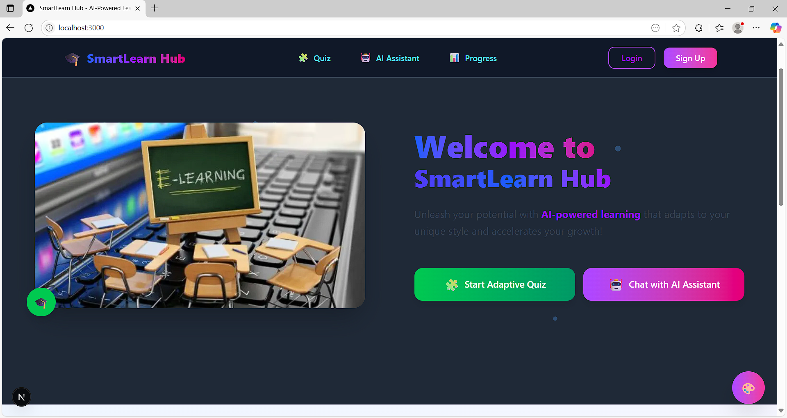
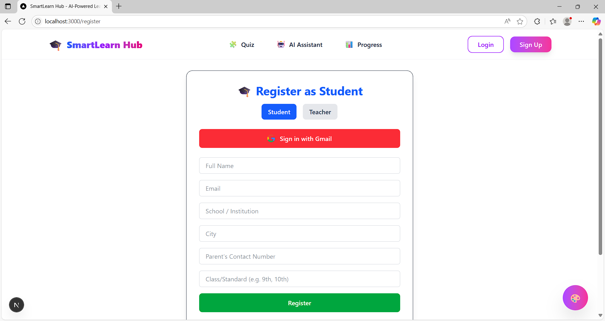
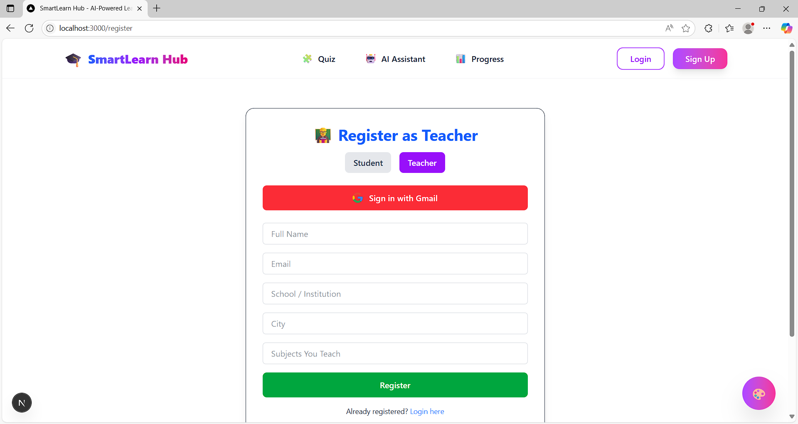
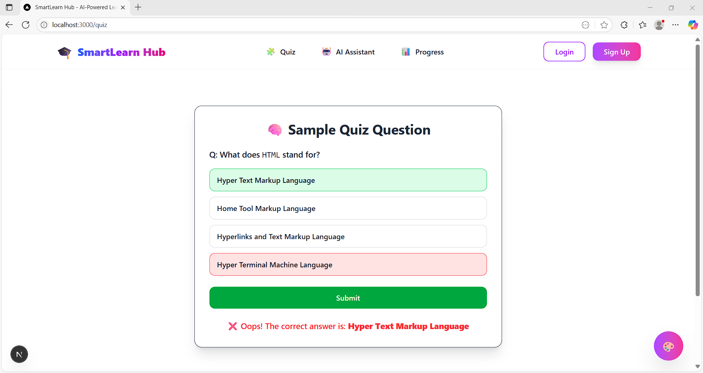

#  SmartLearn Hub

SmartLearn Hub is an AI-powered learning platform that helps students and teachers create, solve, and manage quizzes adaptively. With a modern interface and GPT-4-powered AI assistant, it enhances your academic journey like never before.

##  Features

- 🎯 Adaptive AI Quiz System
- 🤖 GPT-4 Powered Assistant
- 🎨 Dynamic Theme Support (Light, Dark, Blue, Purple, etc.)
- 🧠 Smart Registration for Students & Teachers
- 🔐 Google Authentication (Planned)
- 📈 Performance Progress Section (Coming Soon)

## 📸 Screenshots

### 🏠 Home Page  


### 🧑‍🎓 Student Registration  


### 👨‍🏫 Teacher Registration  


### 🧪 Adaptive Quiz  


> Note: Update the paths if your screenshots are stored elsewhere.

## 🛠 Tech Stack

- **Framework**: Next.js 14 (App Router)
- **Styling**: Tailwind CSS + Framer Motion
- **Auth**: Google (via NextAuth) *(Coming Soon)*
- **Database**: MongoDB with Mongoose *(Planned for production)*
- **UI Enhancements**: Theme Drawer, Motion Animations, Sticky Navbar

## 📦 Setup Locally

```bash
git clone https://github.com/RohitKamble171012/SmartLearn-Hub.git
cd SmartLearn-Hub
npm install
npm run dev

